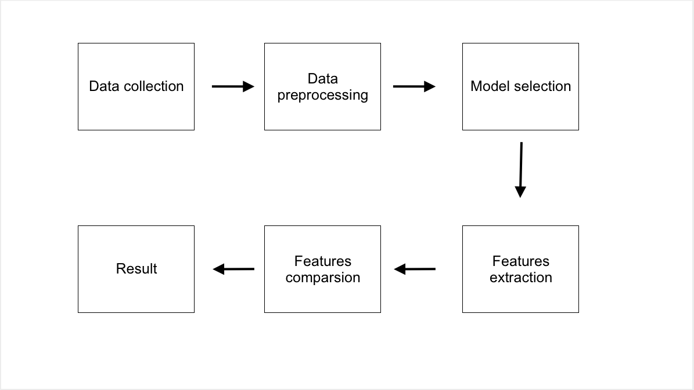
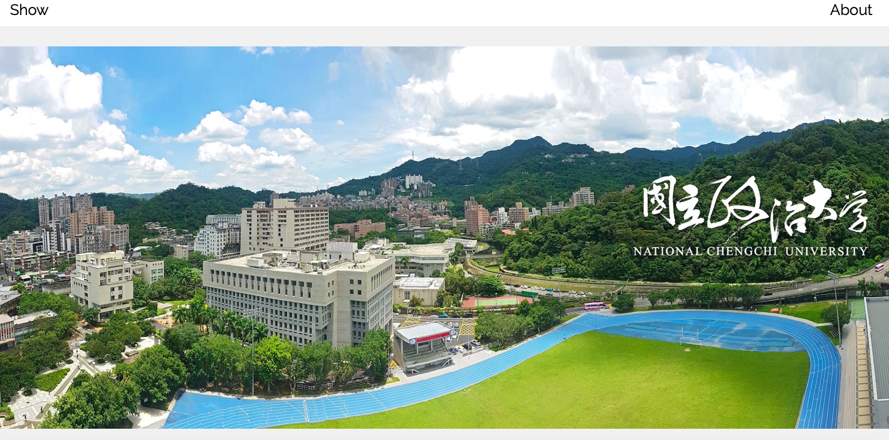
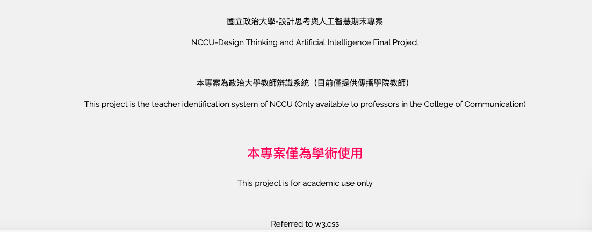
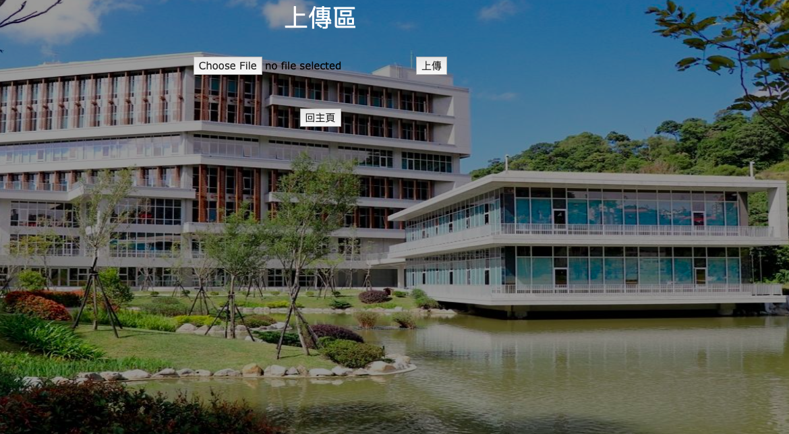
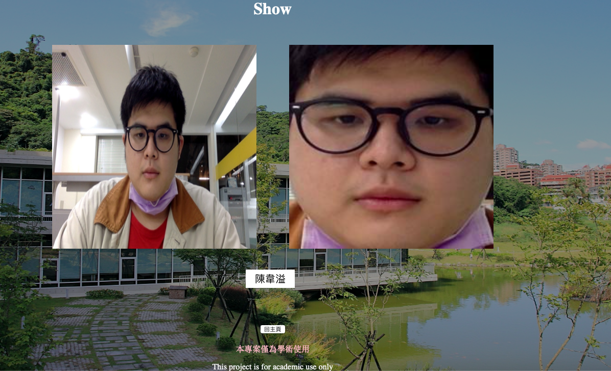

# Facenet_Project

This repository is a small FaceNet project, and I also completed it alone in the first semester of my junior year.

## About this project

This project is the teacher identification system of NCCU (Only available to professors in the College of Communication).

*This project is for academic use only*
## The required libraries

* Flask
* gunicorn
* Jinja2
* numpy==1.19.5
* torch==1.10.0+cpu
* torchvision==0.11.1+cpu
* pillow
* [facenet-pytorch](https://github.com/timesler/facenet-pytorch)
* h5py

## Overall operational process

 1. Model selection
    * [facenet-pytorch](https://github.com/timesler/facenet-pytorch)
 
 2. Features comparsion
    * [Cosine similarity](https://en.wikipedia.org/wiki/Cosine_similarity)
  
 3. Deploy to Azure and Heroku

## Project presentation
 - Home page
 
 
 `  `
 
 - Upload page
 
 `  `
 
 - Result presentation
 
 
 
 ## References
* [Inception-v4, Inception-ResNet and the Impact of Residual Connections on Learning](https://arxiv.org/abs/1602.07261)  
* [Joint Face Detection and Alignment using Multi-task Cascaded Convolutional Networks](https://arxiv.org/abs/1604.02878)  
* [CS231n](http://cs231n.stanford.edu/schedule.html)  
* [FaceNet: A Unified Embedding for Face Recognition and Clustering](https://arxiv.org/pdf/1503.03832.pdf)  
* [facenet-pytorch](https://github.com/timesler/facenet-pytorch)  
* [Cosine similarity](https://en.wikipedia.org/wiki/Cosine_similarity)  
